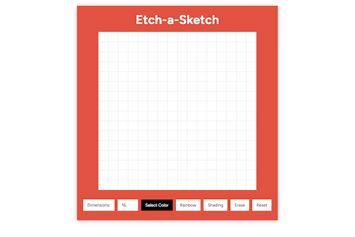

# Etch-a-Sketch

Unleash your creativity with this virtual etch-a-sketch app! Change the block size and/or color, and use the eraser, shading, and rainbow features as needed.

  <a href="https://nicholaspreziosi.github.io/etch-a-sketch/">

</img>
  </a>

## Technologies Used

        <li style="margin: auto">
        
        HTML
    </li>
        <li>
        
        CSS
    </li>
    <li>
        
        JavaScript
    </li>

## Live Demo

View live demo [here](https://nicholaspreziosi.github.io/etch-a-sketch/).
